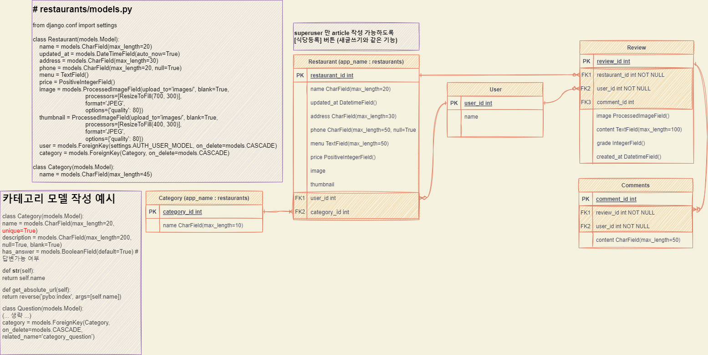
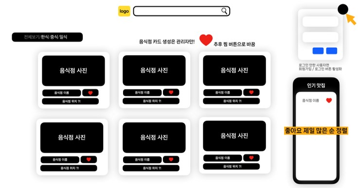
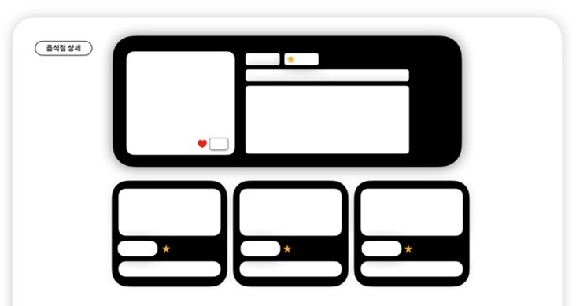

# 🗂️ 2022 Semi Project Ⅰ

> 서비스 이름 : 점메추(jeommechoo)
>
> 서비스 소개 : 전국 팔도 맛잘알들이 모인 맛집 추천 SNS
>
> 제작 기간 : 2022-10-31 ~ 2022-11-07
>
> 팀 구성 : 20팀 JMC.CO(주) / 류진숙, 송희수, [이수경](https://github.com/code-sum), 최준홍
>
> 결과 : 전체 29팀 중 1위 [최우수상]
>
> 🌐 Link : https://jeommechoo.herokuapp.com/
>
> ---
>
> < Contents >
>
> [1. 프로젝트 개요](#1-프로젝트-개요)
>
> [2. 프로젝트 기획](#2-프로젝트-기획)
>
> [3. 프로젝트 설계](#3-프로젝트-설계)
>
> [4. 기능 구현](#4-기능-구현)
>
> [5. 성과](#5-성과)
>
> ---

## 1. 프로젝트 개요

#### 1-1. 요구사항 명세

> 아래 조건을 만족하는 회원제 커뮤니티 서비스 개발

- **CRUD** 구현
- **Staticfiles** 활용 정적 파일(images, CSS, JS) 다루기
- **Django Auth** 활용 회원 관리 구현
- **Media** 활용 동적 파일 다루기
- 모델간 **1 : N** 관계 매핑 코드 작성 및 활용
  - 유저 - 리뷰
  - 유저 - 댓글
  - 리뷰 - 댓글

#### 1-2. 기대 효과

>  지도 API 를 활용하여 전국적인 맛집 공유 플랫폼 제작

- 메인화면에 <실시간 별점 랭킹> 을 구현하여 인기있는 식당을 노출한다.
- 메인화면에 <식당 카테고리> 탭과 <식당이름 검색> 기능을 구현하여 조건에 맞는 정보를 전달한다.
- <사용자 팔로우>, <찜하기>, <별점>, <리뷰>, <댓글> 등 커뮤니티 서비스의 기본 기능들을 갖춘다.
- <사용자별 리뷰 모아보기>, <실시간 리뷰 피드>, <내가 찜한 식당 모아보기> 등의 추가 기능을 통해 편의성을 높인다.
- <랜덤메뉴 추천> 기능을 구현하여 서비스에 엔터테인먼트 요소를 추가한다.

#### 1-3. 역할 분담

- [**이수경**](https://github.com/code-sum) Backend
  - 프로젝트 베이스 코드 작성
  - 서비스 백엔드 기능 50% 기획 및 구현
  - PPT 제작
  
- **최준홍** Frontend
  
- **류진숙** Frontend / 팀장
- **송희수** Backend

## 2. 프로젝트 기획

#### 2-1. 핵심 기능

- Naver Map API 활용하여 식당별 지도 및 마커 표시
- 식당 카테고리 분류(10개) 및 식당 이름 검색 기능
- 전체 사용자 계정별로 분류한 <리뷰 모아보기> 기능
- 별점 높은 순으로 1~10위 <실시간 핫플> 랭킹 표시
- 관리자 계정 : 신규 식당 데이터 등록/수정, 폐업 식당 데이터 삭제
- 사용자 계정
  - 식당별 리뷰 및 댓글 등록, 찜하기, 별점평가
  - 프로필에서 타 유저 팔로우, 내가 쓴 리뷰, 내가 찜한 식당(지도 마커) 확인

#### 2-2. 개발 환경

                

- Programming Language : Python
- Script Language (Client) : JavaScript (ES6+)
- Framework : Django (3.2.13)
- Library : Bootstrap (5.2.2), jQuery (3.6.1)
- Web : HTML 5, CSS 3
- SCM : Git
- DB : PostgreSQL, SQLite 3
- Deploy : Heroku, AWS S3
- IDE : Visual Studio Code
- Tools : Github, Notion, .ENV

## 3. 프로젝트 설계

#### 3-1. DB 설계 (E-R 다이어그램)

#### 3-2. 화면 설계

▲ 서비스 메인 화면 설계

▲ 식당 상세페이지 화면 설계

▲ 사용자 개인 프로필 화면 설계

## 4. 기능 구현

#### 4-1. 기능별 소스코드

- 회원관리 기능 (`/accounts`)
  - 사용자별 리뷰 모아보기
  - 내가 쓴 리뷰 모아보기
  - 내가 찜한 식당 모아보기

- 식당관리 기능 (`/restaurants`)
  - 메인화면 - 식당 목록 조회

- 리뷰관리 기능 (`/reviews`)
  - 실시간 리뷰
  - 리뷰 생성/수정/삭제
  - 리뷰 댓글 생성/삭제

- 랜덤메뉴 추천

#### 4-2. 문제 해결 (이수경 개발자)

- 문제1
- 문제2

## 5. 성과

#### 5-1. 수상내역

#### 5-2. 프로젝트 후기

- **류진숙** : 원하는 아이디어를 말씀드렸을때 전부 다 구현해주시고 팀워크도 너무 좋았기에 행복한 팀 프로젝트였다. 네이버 지도 API를 이용하여 MTV패턴에 적용하여 처음으로 구현해보았는데 이 때, 여러가지의 자료들을 참고하여 스스로 이슈를 해결하면서 몰랐던 지식들을 많이 습득하게 되었다.
- **최준홍** : 팀 프로젝트에 이정도로 열정을 가지고 참여한 적은 처음이다. 하지만 열정이 과하여 내가 짜서 구현한 코드가 팀원들에게 피해를 끼칠수도 있다는걸 깨닫게 되었고, 이를 통해 다음번 프로젝트때는 좀 더 원활한 의사소통과 세분화된 기획을 통해 좀 더 효율적인 분업을 할것이다!
- **송희수** : 다양한 템플릿 문법을 공부 해볼 수 있었다. 또한 세개의 앱을 연결하면서 정참조와 역참조에 대하여 더욱 더 심도있게 찾아 볼수 있었다. Django ORM 다양한 메서드를 배울 수 있었습니다.
- **[이수경](https://github.com/code-sum)** : 처음으로 3개의 앱을 생성했기 때문에 각각의 앱에 선언된 모델을 참조/역참조 하는 작업이 어려웠습니다. 그러나 어려운 이슈를 해결하는 과정에서 실습에서도 써보지 못했던 다양한 Django ORM 메서드를 활용해볼 수 있어서 유익한 경험이었습니다.

## Daily Scrum

▶ [보러가기](scrum/)

---

⬆️ [(위로가기)](https://github.com/code-sum/jeommechoo)